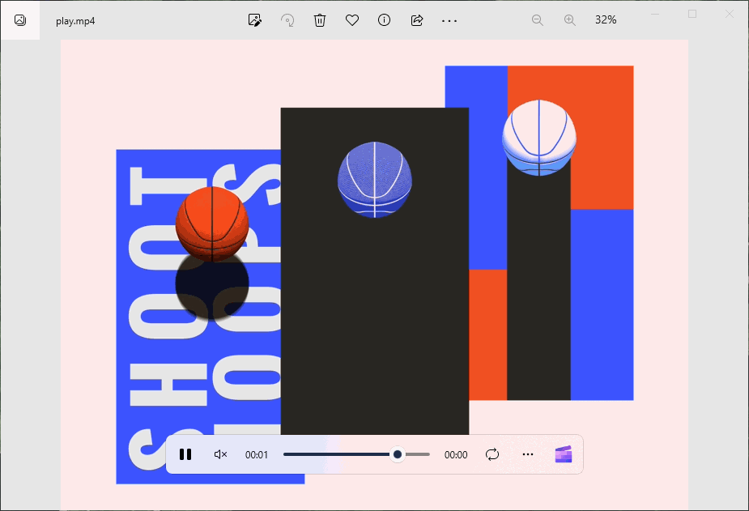

# GifCapture

快速捕获桌面区域并将其直接保存为 .GIF 文件

- 录制指定的区域
- 录制指定的窗口
- 多显示器环境下，录制指定的屏幕

GifCapture can capture an area of your desktop and save it directly to .GIF

- Record specified area
- Record the specified window
- In a multi-monitor environment, record the specified screen

## 捐助

感谢您的捐助，将有助于 TinyGUI 的后续开发，捐款将用于硬件、软件、服务器托管等费用。

再次感谢您的支持！

## Donate

Thank you for your donation, it will help the subsequent development of TinyGUI, donations will be used for hardware, software, server hosting and other expenses.

Thanks again for your support!

[PayPal](https://paypal.me/chenjing9412)